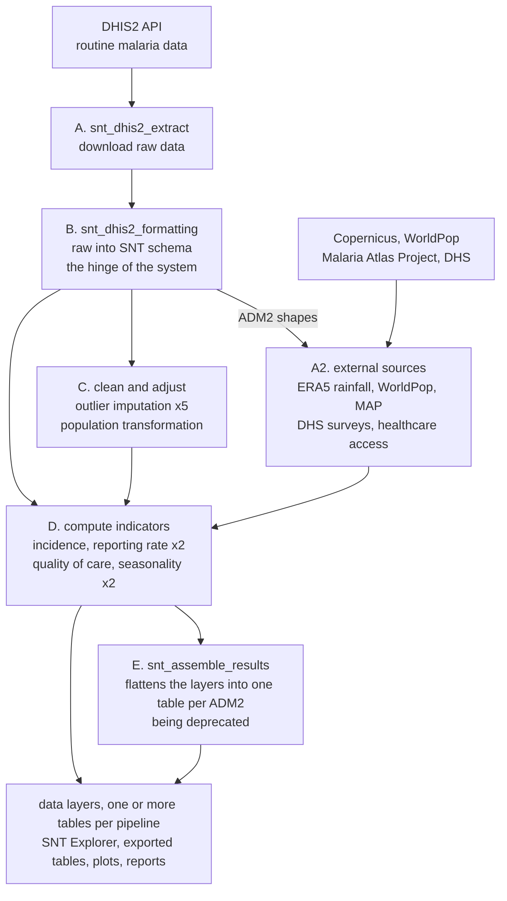

# 🦟 SNT — Subnational Tailoring pipelines

Data pipelines that turn a country's routine health data into the evidence base for **subnational
tailoring (SNT) of malaria interventions** — deciding which interventions to deploy where, at a
sub-national level.

They take monthly malaria case data from a country's **DHIS2** health information system and
combine it with rainfall, population, malaria-prevalence and survey data from external sources.
Each pipeline produces one or more **data layers**: tables of indicators — incidence, reporting
completeness, seasonality, quality of care — for every administrative unit in the country, plus
the plots and HTML reports that go with them. Which administrative level that is varies by
country; throughout this repository it is called **`ADM2`**, and what it means on the ground
(district, health zone, commune…) depends on the country's own hierarchy.

The layers are the deliverable. They can be used as they are, or loaded into the
[SNT Explorer](https://www.snt-toolbox.org/snt-explorer/)
([docs](https://docs.snt-toolbox.org/en/a-propos-du-snt-explorer.html)), a separate tool where
national malaria programmes explore the results and build intervention scenarios.

Everything here runs on **[OpenHEXA](https://openhexa.org)**, Bluesquare's open-source data
platform. This repository is the **source** for ~20 pipelines; OpenHEXA publishes them as a
*template* that each country's workspace subscribes to.

---

## 🗺️ How it works, in one picture

Each box is one or more standalone pipelines, **launched by hand** from the OpenHEXA UI. They pass
data to each other through OpenHEXA **datasets** — never by calling each other directly. Stages
`C` and `A2` publish usable layers of their own, not just intermediates, and the Explorer will
increasingly read those datasets directly rather than the assembled table.

The full pipeline-by-pipeline inventory is in
[`docs/DATA_ARCHITECTURE.md` §1.1](docs/DATA_ARCHITECTURE.md#11-the-20-pipelines-at-a-glance), where
the stage letters above are used throughout (stage `A2` here is written `A′` there).

---

## 📂 What's in this repo

| Path | What it is |
|---|---|
| `<pipeline_name>/pipeline.py` | Orchestration, Python. **Deployed automatically** by CI on merge to `main`. |
| `<pipeline_name>/requirements.txt` | That pipeline's dependencies. Deployed with it. |
| `<pipeline_name>/readme.md` | The pipeline's user-facing contract — read this before running it. |
| [`pipelines/`](pipelines/) | **The analytics: R notebooks and helpers.** *Not* deployed by CI — see below. |
| [`code/`](code/) | Shared R library used across pipelines (`snt_utils`, `snt_report`, `snt_palettes`). |
| [`configuration/`](configuration/) | Per-country config **reference copies** — the live file lives in each workspace. |
| [`docs/`](docs/) | Architecture, glossary, standards, ownership. |
| [`dev/`](dev/) | Optional local Python tooling. Never runs on OpenHEXA. |
| [`.claude/`](.claude/) | Guardrails for AI coding agents. Active on clone. |
| [`deprecated/`](deprecated/) | History. Never use as a template. |

---

## 🧭 Start here

Pick the row that matches what you came for.

| I want to… | Read |
|---|---|
| understand the system in 10 minutes | [`docs/DATA_ARCHITECTURE.md`](docs/DATA_ARCHITECTURE.md) §1–2 |
| know what a term means — `N1`, `PfPR`, `CSB`, ADM2, "Magic Glasses" | [`docs/GLOSSARY.md`](docs/GLOSSARY.md) |
| run a pipeline, or know exactly what it produces | that pipeline's own `readme.md` |
| follow the data end to end | [`docs/DATA_ARCHITECTURE.md`](docs/DATA_ARCHITECTURE.md) §3 |
| read the epidemiological method | the R notebooks in `pipelines/<name>/code/*.ipynb`, with [`docs/GLOSSARY.md`](docs/GLOSSARY.md) §4 open beside them |
| **change any code** | [`CLAUDE.md`](CLAUDE.md) — start at the [rule Register](CLAUDE.md#register) |
| write or update a pipeline `readme.md` | [`docs/PIPELINE_README_STANDARD.md`](docs/PIPELINE_README_STANDARD.md) |
| know who to ask about a pipeline | [`docs/OWNERSHIP.md`](docs/OWNERSHIP.md) |
| set up locally | [`dev/README.md`](dev/README.md) |

---

## ⚠️ Non-obvious things

Facts that are not visible from the code and that newcomers reliably get wrong. Each is
deliberate; none is a bug to fix.

1. **These pipelines are not a DAG.** Nothing schedules them and nothing enforces an order. A
   person opens the OpenHEXA UI and presses Run, one pipeline at a time. So a results table can
   mix data of different vintages, and you can never assume your upstream ran today.
   → [§4](docs/DATA_ARCHITECTURE.md#4-orchestration-model)

2. **The Python and R halves ship by different routes.** Merging `pipeline.py` to `main` deploys
   it. Merging a notebook deploys **nothing** — R code reaches a workspace only when an operator
   runs that pipeline with **`Pull scripts` = ON**. Always say so when handing over a notebook
   change. → [`CLAUDE.md` rule 2](CLAUDE.md#the-five-rules-that-matter-most)

3. **A country may not be running the notebook you are looking at.** A notebook named
   `<generic_name>_<CC>.ipynb` — e.g. `snt_seasonality_rainfall_NER.ipynb` — runs *instead of* the
   generic one, in the single workspace whose configured country code matches. This lets a country
   keep a bespoke analysis that `Pull scripts` will not clobber; the flip side is that `Pull
   scripts` cannot deliver one either, so variants have to be edited **in the workspace** and there
   is no mechanism propagating them. A fix to the generic notebook silently misses those countries.
   → [`CLAUDE.md`](CLAUDE.md#country-specific-notebook-variants)

4. **OpenHEXA datasets are the contract, not the filesystem.** A file written to `data/` that is
   not registered with `add_files_to_dataset(...)` is invisible to every downstream pipeline.

5. **Some pipelines deliberately overwrite each other.** The five outlier-imputation pipelines
   write identical filenames, as do the two reporting-rate pipelines. They are *alternatives*: the
   analyst tries several methods and the last run wins. Renaming outputs per method would break
   this. → [Traps](CLAUDE.md#traps)

6. **There is no test suite and no CI lint.** `ruff` is the only automated check and nothing runs
   it for you. Analytics changes are reviewed by eye. Do not report a test run you could not have
   performed.

---

## 🛠️ Working on this repo

### 🔑 Before you start

- Access to the relevant **OpenHEXA workspace with the `Admin` role** — ask your team lead.
  Everything real runs there: the data, the datasets, the R kernel.
- A local clone of this repo. Nothing else is required to *read* it.
- Optional but recommended: the local Python tooling (`ruff`, `nbstripout`) — see
  [`dev/README.md`](dev/README.md).

### 🗓️ Your first day

1. Read [`docs/DATA_ARCHITECTURE.md`](docs/DATA_ARCHITECTURE.md) §1–2, then skim
   [`docs/GLOSSARY.md`](docs/GLOSSARY.md).
2. Read [`CLAUDE.md`](CLAUDE.md) — the [Register](CLAUDE.md#register) is the whole rulebook in one
   table. It applies to humans and AI agents alike.
3. Open the OpenHEXA workspace and run one pipeline end to end, reading its `readme.md` first.
4. Set up locally: `conda env create -f dev/environment.yml`.
5. Take a small ticket. Ask your pipeline's contact in [`docs/OWNERSHIP.md`](docs/OWNERSHIP.md)
   before changing anything in `pipelines/*/code/`.

### 🤖 Working with an AI coding assistant

Assumed, not merely tolerated — most of the documentation in this repo is written to be read by a
person *or* an agent.

- **[`CLAUDE.md`](CLAUDE.md) is the rulebook, and it is not Claude-specific.** [Claude
  Code](https://claude.com/claude-code) loads it automatically; with any other assistant (Cursor,
  Copilot, Gemini, …) paste it in or point the tool at it. The
  [Register](CLAUDE.md#register) is all 19 rules in one table — the cheapest thing to give a model
  that is about to touch this repo.
- **[`.claude/`](.claude/) ships live guardrails.** They are active the moment you clone: a hook
  that blocks destructive and history-rewriting `git` commands, plus a matching deny list. If an
  agent gets blocked, that is the guardrail working — don't route around it.
- **[`docs/PIPELINE_README_STANDARD.md`](docs/PIPELINE_README_STANDARD.md) is deliberately
  tool-agnostic** — it works as instructions for a human or as a prompt for any model.
- **An agent's output still needs the domain review below.** An assistant cannot tell you that an
  epidemiological number moved in the wrong direction, and neither can anything else in this repo.
  Nothing here changes who has to approve a change to the analytics.

### 🔀 How changes get in

**Every change to `main` goes through a pull request, and every PR should be reviewed by a team
member** — for analytics changes, by the person listed for that pipeline in
[`docs/OWNERSHIP.md`](docs/OWNERSHIP.md). Core data-processing logic (the R notebooks and `code/`)
is not something to change unreviewed, however small the diff looks: nothing downstream will tell
you that a number moved.

Four things that are never OK:

- **Committing country data.** No `.csv` / `.xlsx` / `.parquet` / `.rds` / `.geojson` with real
  values. This is health data for real districts. `.gitignore` blocks most of it — never
  `git add -f` past it.
- **Committing notebook outputs.** Strip them first (`nbstripout`).
- **Putting business logic in `pipeline.py`.** It orchestrates; the analytics live in R.
- **Publishing from a workspace other than `snt-development`.** It creates a duplicate template
  nobody is subscribed to. → [why](CLAUDE.md#always-publish-from-snt-development)

Before opening a PR, walk the
[handover checklist](CLAUDE.md#handover-checklist) — it is short and it maps to the rules.

---

## 🚧 Status and known limitations

Stated plainly, so nobody spends a day rediscovering them:

| | |
|---|---|
| **No automated tests** | `ruff` is the only check, and no CI job runs it. |
| **Dependencies are unpinned** | Both entries in every `requirements.txt` install from a Git branch, so two deploys of identical code can produce different runtimes. → [detail](CLAUDE.md#suggestions-logged-for-later-evaluation-giulia) |
| **No full offline development** | R notebooks are edited locally but execute on the workspace kernel. → [the loop](CLAUDE.md#editing-r-notebooks-the-vs-code-remote-kernel-loop) |
| **`snt_assemble_results` is being deprecated** | The SNT Explorer will read the OpenHEXA datasets directly. Don't extend it. |
| **Run order is not written down yet** | Tracked in [`docs/DATA_ARCHITECTURE.md` §4.2](docs/DATA_ARCHITECTURE.md). |

---

## ⚖️ Licence

[MIT](LICENSE) — **provisional**, pending confirmation by the team. See
[`docs/OWNERSHIP.md`](docs/OWNERSHIP.md) for open documentation items.

This repository contains **code and documentation only**. No country health data is stored here,
and none ever should be.
